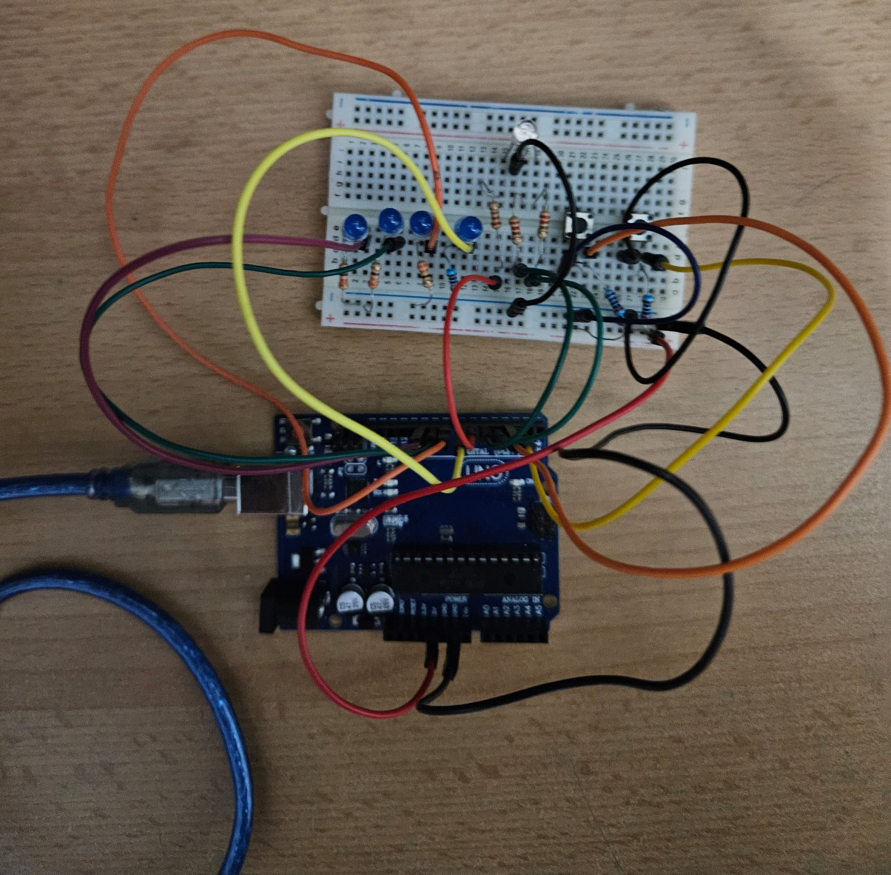
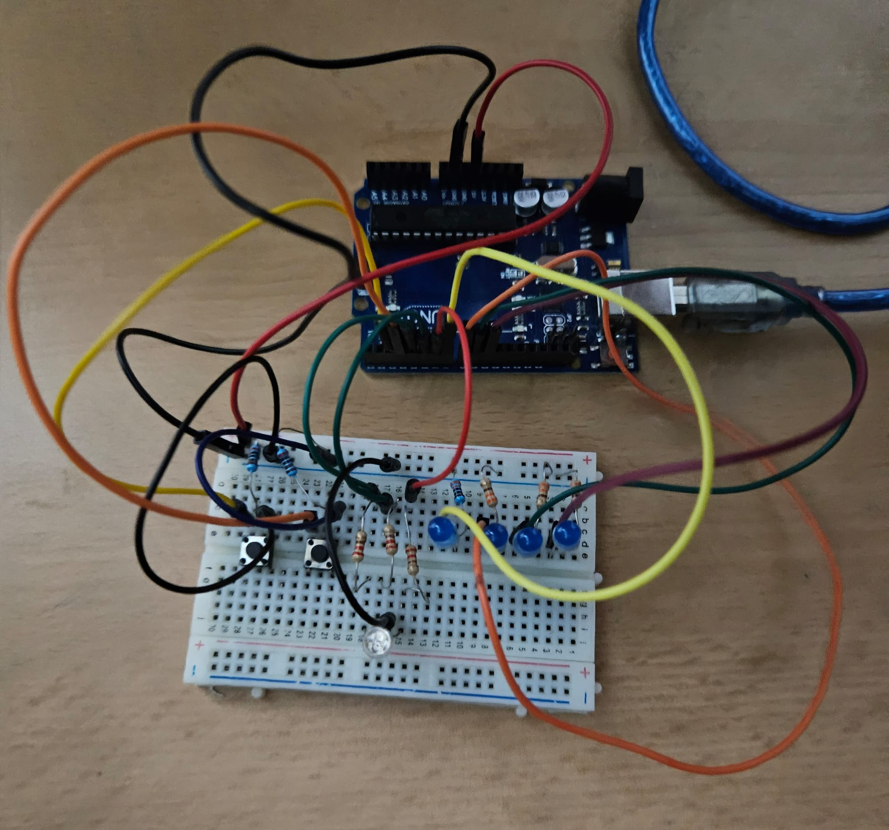
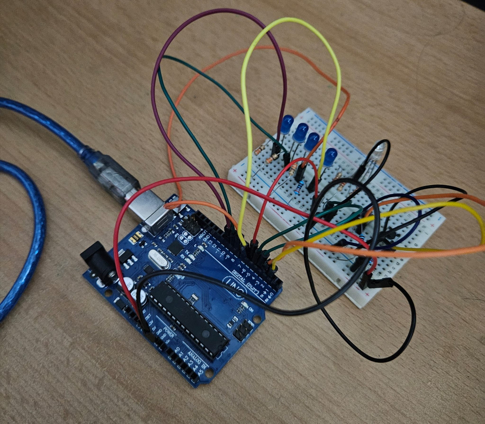
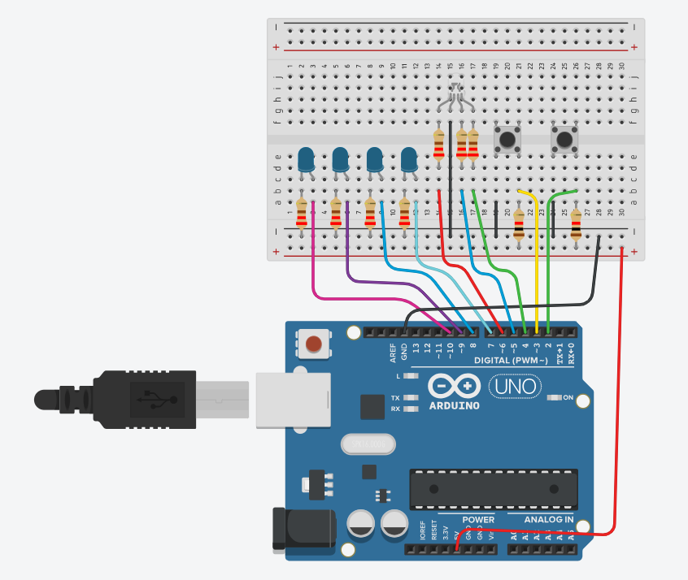

# Sistem de încărcare a unui vehicul electric

## Detalii Tehnice

Led-ul RGB reprezintă disponibilitatea stației. Dacă stația este liberă, led-ul va fi verde, iar dacă stația este ocupată, se va face roșu. Led-urile simple reprezintă gradul de încărcare al bateriei, pe care îl vom simula printr-un loader progresiv (L1 = 25%, L2 = 50%, L3 = 75%, L4 = 100%). Loader-ul se încarcă prin aprinderea succesivă a led-urilor, la un interval fix de 3s. LED-ul care semnifică procentul curent de încărcare va avea starea de clipire, LED-urile din urma lui fiind aprinse continuu, iar celelalte stinse. Apăsarea scurtă a butonului de start va porni încărcarea. Apăsarea acestui buton în timpul încărcării nu va face nimic. Apăsarea lungă a butonului de stop va opri încărcarea forțat și va reseta stația la starea liberă. Apăsarea acestui buton cât timp stația este liberă nu va face nimic.

## Cerința

Starea stației este ‘liberă’. Loader-ul este stins, iar led-ul pentru disponibilitate este verde. Se apasă butonul pentru start. Led-ul pentru disponibilitate se face roșu, iar încărcarea începe prin aprinderea primului LED L1. Led-ul 1 clipește timp de 3s, celelalte fiind stinse. După încărcarea primului procent de 25%, led-ul rămâne aprins și se trece la următorul led, care va începe să clipească. La finalizarea încărcării, toate led-urile vor clipi simultan de 3 ori, iar apoi se vor stinge, pentru a semnaliza finalizarea procesului. Led-ul pentru disponibilitate se face verde. Dacă oricând de la pornirea încărcării până la finalizarea acesteia este apăsat lung (min 1s) butonul de stop, încărcarea se întrerupe prin animația de final (toate led-urile clipesc de 3 ori), iar led-ul pentru disponibilitate devine verde.

## Descrierea Proiectului

Acest proiect simulează o **stație de încărcare** utilizând o placă Arduino UNO și LED-uri care oferă un feedback vizual pentru starea stației și progresul încărcării. Se pornește și se oprește procesul de încărcare prin intermediul a două butoane: unul pentru **Start** și unul pentru **Stop**. Sistemul include un set de LED-uri albastre pentru a indica progresul încărcării și un LED RGB pentru a semnaliza starea de disponibilitate a stației.

### Obiectivele Proiectului

1. **Simulare a procesului de încărcare**: Sistemul va reprezenta încărcarea unei baterii în trepte de 25%, cu indicatori vizuali pentru fiecare treaptă.
2. **Control prin butoane**: Procesul de încărcare este controlat printr-un buton de **Start** și un buton de **Stop**. Apăsarea butonului **Start** pornește încărcarea dacă stația este liberă, iar o apăsare lungă a butonului **Stop** (mai mult de 1 secundă) oprește procesul de încărcare și face ca LED-urile albastre să clipească de 3 ori înainte de resetarea stației.
3. **Feedback vizual clar**: LED-urile albastre vor indica progresul încărcării, iar LED-ul RGB va semnaliza disponibilitatea stației.

## Componente Utilizate

- **Placă Arduino UNO**
- **LED RGB** 
- **4 LED-uri albastre** 
- **9 Rezistoare** 
- **2 Butoane** 
- **Breadboard**
- **Cabluri de conectare**

## Imagini cu Setup-ul Fizic

## Link video Youtube cu funcționalitatea montajului fizic

[Link către videoclipul YouTube](https://youtube.com/watch?v=mPNuXBadCfc)

## Schema electrică

Schema electrică a proiectului a fost realizată în Tinkercad

