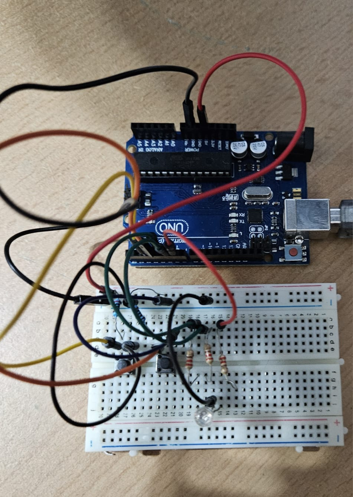
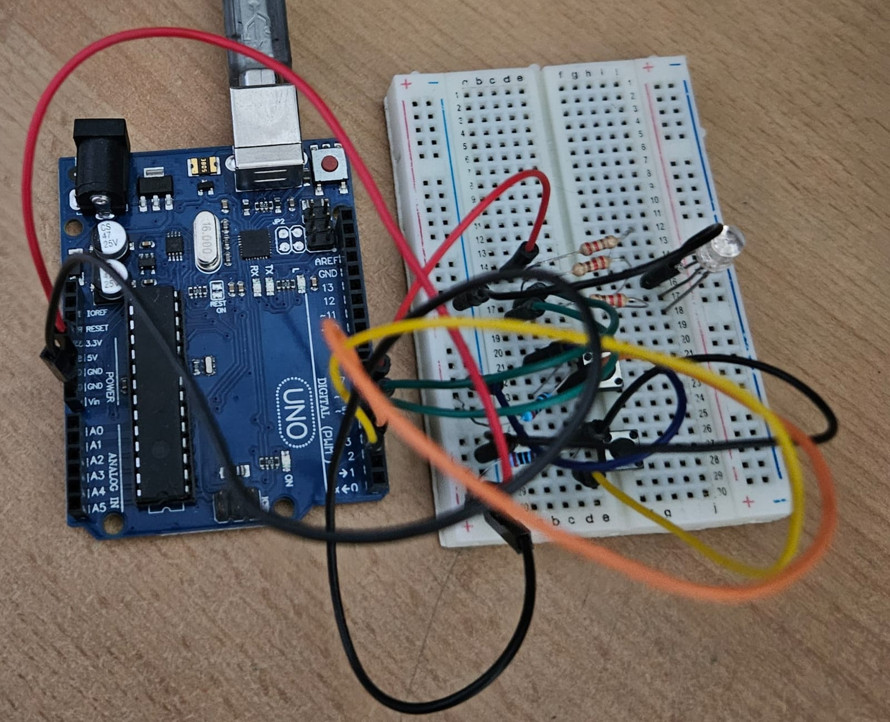
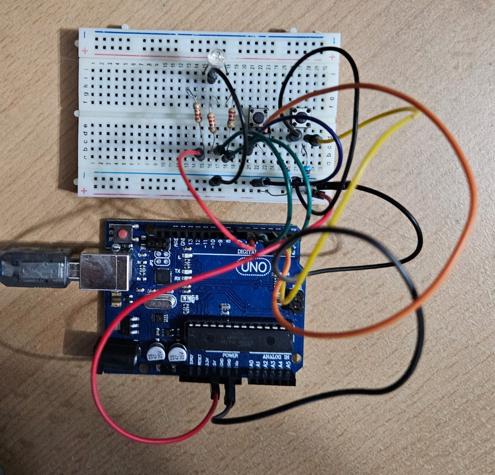
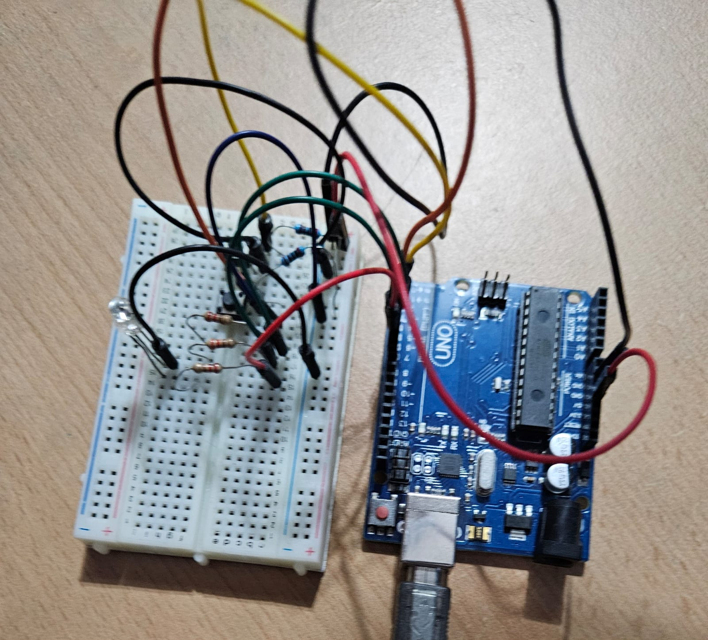
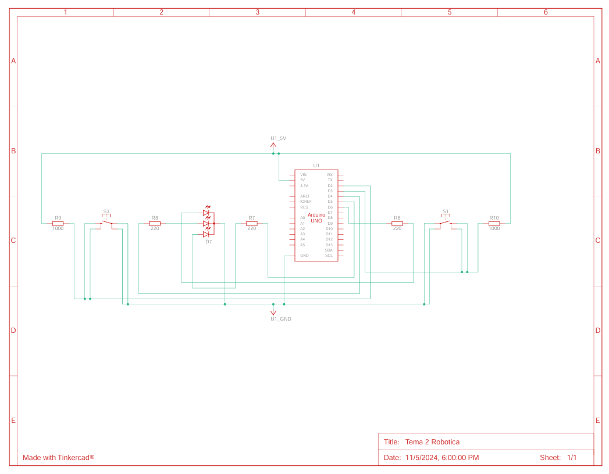
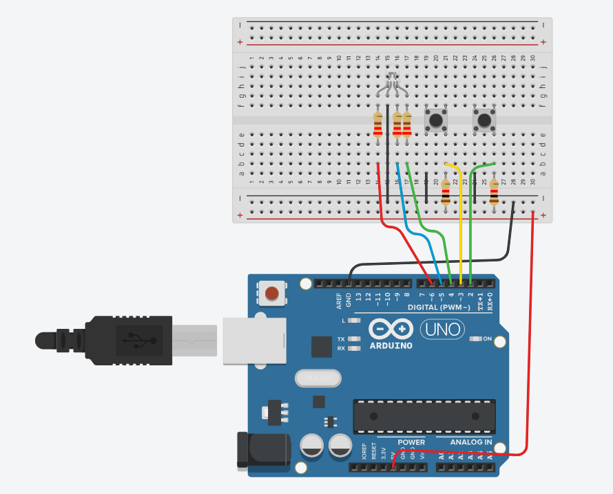

# TypeRacer Game

## Detalii Tehnice

### LED RGB - Indicator de stare:
În starea de repaus, LED-ul va avea culoarea albă.
La apăsarea butonului de start, LED-ul va clipi timp de 3 secunde, indicând o numărătoare inversă până la începerea rundei.
În timpul unei runde: LED-ul va fi verde dacă textul introdus este corect și va deveni roșu în caz de greșeală.
### Butonul Start/Stop:
Modul de repaus: Dacă jocul este oprit, apăsarea butonului inițiază o nouă rundă după o numărătoare inversă de 3 secunde.
În timpul unei runde: Dacă runda este activă, apăsarea butonului o va opri imediat.
### Butonul de dificultate:
Butonul de dificultate controlează viteza cu care apar cuvintele și poate fi folosit doar în starea de repaus.
La fiecare apăsare, dificultatea se schimbă ciclind între: (Easy, Medium, Hard).
La schimbarea dificultății, se trimite un mesaj prin serial: “Easy/Medium/Hard mode on!”.
### Alte observații:
Timpul alocat pentru o rundă este de 30 de secunde.
La sfârșitul fiecărei runde, se va afișa în terminal câte cuvinte au fost scrise corect.

## Cerința

Jocul este în repaus. LED-ul RGB are culoarea albă. Se alege dificultatea jocului folosind butonul de dificultate, iar în terminal va apărea “Easy/Medium/Hard mode on!”. Se apasă butonul de start/stop. LED-ul clipește timp de 3 secunde, iar în terminal se va afișa numărătoarea înversă: 3, 2, 1. LED-ul devine verde și încep să apară cuvinte de tastat. La tastarea corectă, următorul cuvânt apare imediat. Dacă nu se tasteaza cuvântul în timpul stabilit de dificultate, va apărea un nou cuvânt. O greșeală face LED-ul să devină roșu. Pentru a corecta cuvântul, se va folosi tasta BackSpace. Dupa 30 de secunde, runda se termină, iar în terminal se va afișa scorul: numărul total de cuvinte scrise corect. Jocul se poate opri oricând cu butonul de start/stop

## Descrierea Temei
Tema constă într-un joc de tastare pe Arduino, unde utilizatorul trebuie să tasteze corect cuvintele afișate într-un interval de timp specificat. Jocul include trei niveluri de dificultate și oferă feedback vizual prin LED-ul RGB. Scopul este de a tasta cât mai multe cuvinte corecte într-un timp limitat.

## Funcționalități principale

1. **LED RGB - Indicator de Stare**
   - **Stare de Repaus:** LED-ul RGB afișează culoarea albă pentru a indica că jocul este oprit.
   - **Numărătoare inversă:** La apăsarea butonului de start, LED-ul RGB clipește timp de 3 secunde, oferind o numărătoare inversă până la începerea jocului.
   - **Indicator în timpul jocului:** 
     - Verde dacă textul introdus este corect.
     - Roșu dacă există o greșeală în textul introdus.

2. **Butonul Start/Stop**
   - **În modul de repaus:** Apăsarea butonului începe o rundă de joc, precedată de o numărătoare inversă de 3 secunde.
   - **În timpul unei runde:** Dacă runda este activă, apăsarea butonului oprește jocul imediat.

3. **Butonul de Dificultate**
   - **Schimbarea nivelului de dificultate:** Butonul poate schimba dificultatea doar în starea de repaus. Dificultatea ciclă între trei moduri: *Easy*, *Medium*, și *Hard*.
   - **Feedback în terminal:** La fiecare schimbare de dificultate, mesajul „Easy/Medium/Hard mode on!” este afișat în terminal.

4. **Generarea Cuvintelor**
   - **Dicționar de cuvinte:** Programul conține o listă de cuvinte care sunt afișate aleatoriu în timpul rundei.
   - **Validare de tastare:** 
     - Dacă un cuvânt este tastat corect, următorul cuvânt apare imediat.
     - În caz de greșeală, LED-ul devine roșu.
     - Dacă timpul pentru un cuvânt expiră, un alt cuvânt este afișat.

## Componente Utilizate

- **Placă Arduino UNO**
- **LED RGB** 
- **5 Rezistoare** 
- **2 Butoane** 
- **Breadboard**
- **Cabluri de conectare**

## Imagini cu Setup-ul Fizic

## Link video Youtube cu funcționalitatea montajului fizic

[Link către videoclipul YouTube](https://www.youtube.com/watch?v=AJaQn9sDx44)

## Schema electrică

Schema electrică a proiectului a fost realizată în Tinkercad

